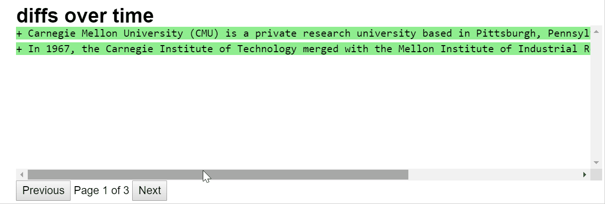

## What is this and how to use it?

Have you ever felt the need to browse through multiple instances of long-form text? Say you trained a model to generate summaries of news articles and tested it on some 100 sample articles from your test set. Now you would like to browse through these 100 outputs (and possibly the corresponding articles that were input). Traditionally you would go about printing different outputs and inputs but it takes a lot of print statements and leads to a bit of clutter if you are printing multiple text-blobs.

The paginate class helps you view an HTML pagination inside a Jupyter notebook to help you navigate through multiple text-blobs in a clean way. Use it as follows 

```python
from paginate import Paginate
```

Define some sample text blobs - let's say multiple versions of the wikipedia intro for CMU that have been extracted at different times. 

```python
txt1='''Carnegie Mellon University (CMU) is a private research university based in Pittsburgh, Pennsylvania. In 1967, the Carnegie Institute of Technology merged with the Mellon Institute of Industrial Research to form Carnegie Mellon University.'''
txt2='''Carnegie Mellon University (CMU) is a private research university based in Pittsburgh, Pennsylvania. Founded in 1900 by Andrew Carnegie as the Carnegie Technical Schools, the university became the Carnegie Institute of Technology in 1912. In 1967, the Carnegie Institute of Technology merged with the Mellon Institute of Industrial Research to form Carnegie Mellon University.'''
txt3='''Carnegie Mellon University (CMU) is a private research university based in Pittsburgh, Pennsylvania. Founded by Andrew Carnegie as the Carnegie Technical Schools, the university became the Carnegie Institute of Technology in 1912 and began granting four-year degrees. In 1967, the Carnegie Institute of Technology merged with the Mellon Institute of Industrial Research to form Carnegie Mellon University.'''
```

All you need to do is put them in a list and construct an object of  the Paginate class with 3 arguments -
* List containing the text-blobs
* Some title for the pagination DOM element
* Height of the DOM element (useful to adjust size according to the length of text displayed)

```python
doc_seq=[txt1, txt2, txt3]
Paginate(doc_seq, "diffs over time", "200px")
```

You will get something like below


But what makes it more useful is the ability to display inline HTML code inside the pagination. You can use this to add a variety of highlights and annotations onto the displayed text. For example, here we highlight the edits between subsequent versions of the text by using some extra code.

```python
from paginate import Paginate
import difflib
import nltk

def showdiff(fr, to):
    differ = difflib.Differ()
    html=""

    for entry in differ.compare(nltk.sent_tokenize(fr), nltk.sent_tokenize(to)):
        if entry[0]=="+":
            html+="<tt style='white-space: pre;background-color:lightgreen'>"+entry+"</tt><br>"
        elif entry[0]=="-":
            html+="<tt style='white-space: pre;background-color:lightcoral'>"+entry+"</tt><br>"
        else:
            html+="<tt style='white-space: pre;'>"+entry+"</tt><br>"

    return html
```


```python
doc_seq=["", txt1, txt2, txt3]
Paginate([showdiff(x,y) for x,y in zip(doc_seq[:-1], doc_seq[1:])], "diffs over time", "200px")
```


You will get something like below




